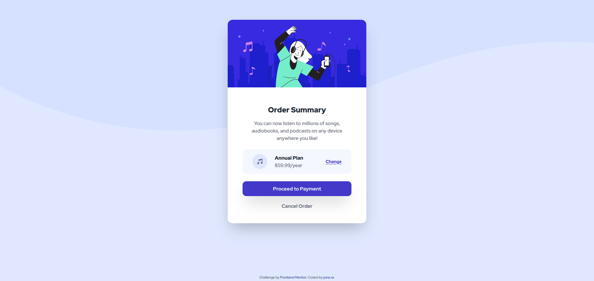

# Frontend Mentor - Order summary card solution

This is a solution to the [Order summary card challenge on Frontend Mentor](https://www.frontendmentor.io/challenges/order-summary-component-QlPmajDUj). Frontend Mentor challenges help you improve your coding skills by building realistic projects. 

## Table of contents

- [Overview](#overview)
  - [The challenge](#the-challenge)
  - [Screenshot](#screenshot)
  - [Links](#links)
- [My process](#my-process)
  - [Built with](#built-with)
  - [What I learned](#what-i-learned)
  - [Continued development](#continued-development)
  - [Useful resources](#useful-resources)
- [Author](#author)
- [Acknowledgments](#acknowledgments)

## Overview

### The challenge

Users should be able to:

- See hover states for interactive elements

### Screenshot

### Links

- Solution URL: [Add solution URL here](https://your-solution-url.com)
- Live Site URL: [Live Site](https://order-summary-component-main-omega.vercel.app/)

## My process

### Built with

- HTML5
- CSS 3
- Flexbox
- Mobile-first workflow
- [Vue.js](https://v3.vuejs.org/)
- [tailwindcss](https://tailwindcss.com/)

### What I learned

Working with Vue and tailwindcss. Some basic flexbox styling. Had to fiddle around with the background image for quite a while, getting it to render the way it's shown in the design layout on both mobile and desktop views.

### Continued development

Definitely plan on using tailwindcss more, it's very nice for quick styling. Want to do more with Vue as well.

### Useful resources

Mostly just reading through the official docs of Vue and tailwind helped me the most.

## Author

- GitHub - [JonathanRe](https://github.com/JonathanRe)
- Frontend Mentor - [@JonathanRe](https://www.frontendmentor.io/profile/JonathanRe)
- Twitter - [@kuoGames](https://www.twitter.com/kuoGames)

## Acknowledgments

Shoutout to the #code-n-eng channel on the DayKnights Discord channel.
